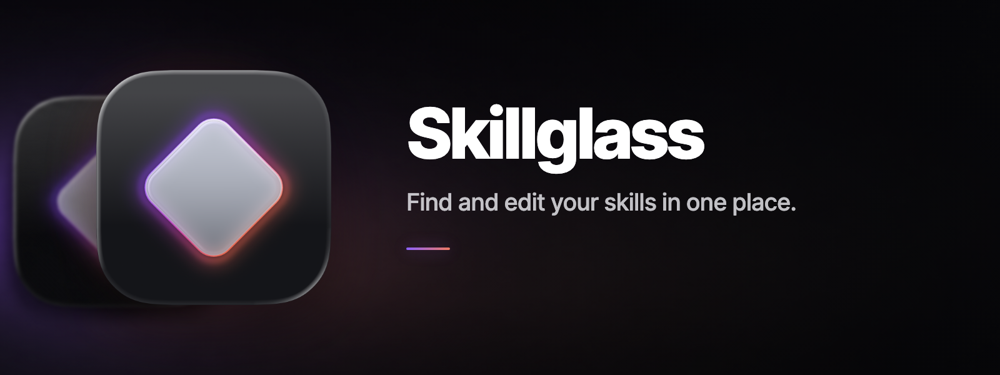
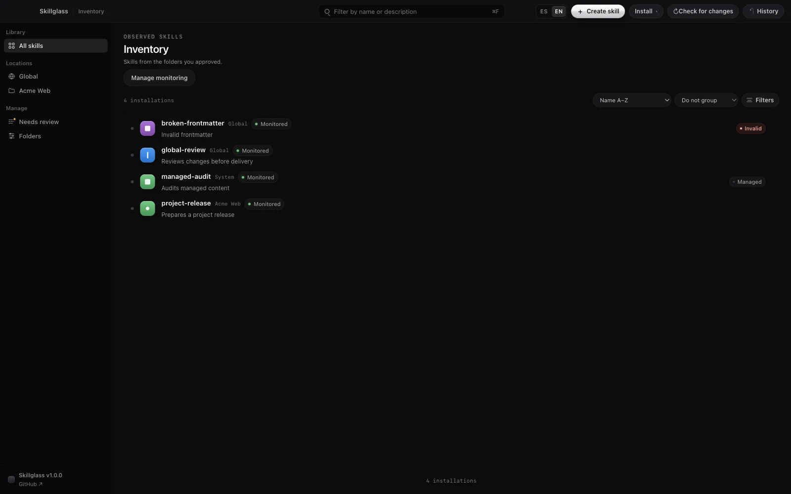

<p align="center">
  
</p>

# Skillglass

Skillglass is a local desktop app for finding, reading, and editing agent skills. It brings Codex skills and any folders containing `SKILL.md` files into one clear inventory, without an account or usage telemetry.

<p>
  <a href="https://github.com/r-bart/skillglass/releases">Downloads</a> ·
  <a href="docs/installation.md">Installation</a> ·
  <a href="https://github.com/r-bart/skillglass/issues">Report an issue</a>
</p>



## What it does

- Finds skills in known Codex locations and folders you choose.
- Lets you search and filter by project, validity, source, and local state.
- Shows duplicate names and every matching location without guessing which copy is active.
- Renders common `SKILL.md` content safely inside the app.
- Creates and edits skills with an exact diff before each write.
- Installs a skill from a local folder or ZIP file.
- Keeps a restart-safe operation history with undo.
- Works in English and Spanish.

## How it works

1. Open Skillglass and approve the folders it may scan.
2. Choose the skills you want to monitor.
3. Search the inventory and open a skill to read its instructions and location.
4. Edit, create, or install a local skill.
5. Review the proposed diff and confirm the write.
6. Use **History** to inspect or undo a recorded change.

Your skill files remain the source of truth. Skillglass stores a local index, snapshots, provenance, and its operation journal so it can explain and reverse its own writes.

## Safety and scope

Skillglass reads and writes only inside folders you explicitly approve. It treats imported skill content as untrusted data and asks for confirmation after showing the exact change it plans to make.

The first release deliberately stays small. It does not:

- activate, deactivate, move, or uninstall skills in Codex;
- install from internet URLs or query a remote registry;
- sync files or generate skills with AI;
- crawl plugin caches automatically;
- update the desktop app automatically.

## Download

Skillglass 1.0.0 is in final local testing. There is no public binary yet. Once the release is ready, the official packages, checksums, and build metadata will appear on the [GitHub Releases page](https://github.com/r-bart/skillglass/releases).

The planned packages are:

| Platform | Architecture | Format |
| --- | --- | --- |
| macOS | Apple Silicon | ZIP containing `Skillglass.app` |
| Windows | x64 | Squirrel installer (`.exe`) |
| Debian / Ubuntu | x64 | `.deb` |
| Fedora and other RPM-based systems | x64 | `.rpm` |
| Arch Linux / Omarchy | x64 | `.pkg.tar.zst` |

The first packages are not signed by a trusted publisher. macOS uses an ad hoc integrity signature; Windows and Linux packages are unsigned. See the [installation guide](docs/installation.md) for verification steps and the current platform status.

## Build and run locally

You need Git, Node.js 24.19.x, and pnpm 11.5.x.

```sh
git clone https://github.com/r-bart/skillglass.git
cd skillglass
corepack enable
pnpm install --frozen-lockfile
pnpm dev
```

Run the repository checks with:

```sh
pnpm typecheck
pnpm lint
pnpm test
```

Build a native package for your current operating system with:

```sh
pnpm make
```

The generated files are written below `apps/desktop/out/make/`. `pnpm make` is not a cross-compiler; each platform must build its own package.

## Contributing and security

Bug reports and focused improvements are welcome. Read [CONTRIBUTING.md](CONTRIBUTING.md) before proposing code. For security issues, follow [SECURITY.md](SECURITY.md) and do not put vulnerability details, private skill contents, or local filesystem paths in a public issue.

Skillglass is open source under the [Apache License 2.0](LICENSE). It is made by [Roberto](https://github.com/r-bart) as a small tool he uses and shares.
