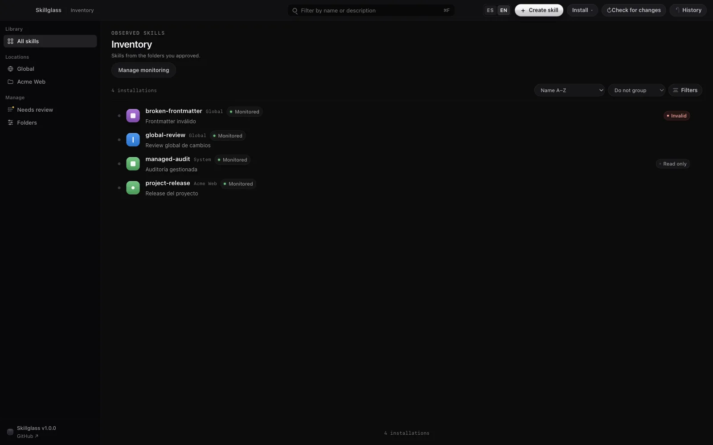

# Skillglass

Find and edit your skills in one place. Skillglass is a local desktop app for
Codex skills and other folders containing `SKILL.md` files.



Skillglass helps you browse the folders you choose, read each skill's
instructions, spot duplicate names, and review changes before saving. It does
not require an account and does not collect usage telemetry.

## Download and compatibility

Skillglass 1.0.0 is being prepared. There is no active public binary download
yet. When the release is published, official binaries will be available only
from this repository's [Releases page](../../releases), alongside
`SHA256SUMS.txt` and `build-metadata.json`.

The release pipeline prepares native packages for macOS, Windows, and Linux.
Only the platforms checked against the final release artifact will be described
as verified. See the [installation guide](docs/installation.md) for package
formats, signing status, and the checks that remain before publication.

The planned files are an Apple Silicon macOS ZIP, a Windows x64 installer, and
one DEB, one RPM, and one Pacman package for Linux x64. All use the canonical
`skillglass-v1.0.0-<platform>-<architecture>` filename recorded in the
installation guide. The build matrix does not by itself define a minimum
supported operating-system version.

## First use

1. Open Skillglass and choose the folders it may scan.
2. Review the proposed Codex locations or add another folder containing
   `SKILL.md` files.
3. Choose which observed skills to monitor and open the inventory.
4. Select a skill to read its instructions and location.
5. Use **Edit** to change `SKILL.md`, review the diff, then confirm the write.
6. Open **History** to undo a recorded operation while the written tree remains
   unchanged outside Skillglass.

The [product demo](https://skillglass.dev/#demo) shows this flow with local
fixtures. Its screenshots use normalized paths and contain no personal files.

## What the first release includes

- Read-only discovery inside explicitly approved folders.
- Search and filters for observed skills, projects, validity, and local source
  state.
- Duplicate-name detection that shows each location without guessing which
  copy Codex uses.
- Safe Markdown rendering for common `SKILL.md` content.
- Create, edit, local folder/ZIP install, exact diff review, and restart-safe
  operation history.
- English and Spanish interface copy.

## Deliberate limits

Skillglass does not activate, deactivate, configure, move, or uninstall skills
in a harness. It does not install from internet URLs, query a remote registry,
sync files, generate skills with AI, or update the desktop app automatically.

Discovery covers known Codex locations and folders you add. It does not crawl
plugin caches automatically. If several skills share a name, Skillglass shows
the copies and their locations; it does not invent activation or precedence
facts that Codex has not exposed.

## Build from source

The source is licensed under Apache 2.0 and is intended for public release with
version 1.0.0. Building requires Git, Node.js 24.19.x, and pnpm 11.5.x.

```sh
git clone https://github.com/r-bart/skillglass.git
cd skillglass
corepack enable
pnpm install --frozen-lockfile
pnpm typecheck
pnpm lint
pnpm test
pnpm make
```

`pnpm make` builds for the current operating system and writes ignored output
below `apps/desktop/out/make/`. It is not a cross-compiler. Platform maker
requirements and install steps are documented in
[docs/installation.md](docs/installation.md).

Run the desktop app or landing page during development with:

```sh
pnpm dev:desktop
pnpm dev:landing
```

Validate the static website with `pnpm check:landing` and
`pnpm build:landing`.

## Security, feedback, and contributions

Skillglass treats imported skill content as untrusted data and writes only
inside approved, user-writable roots after a preview and confirmation. The
[security policy](SECURITY.md) documents local permissions, recovery data,
official binaries, and private vulnerability reporting.

For a bug or product suggestion, open a
[GitHub issue](https://github.com/r-bart/skillglass/issues). The repository has
Issues enabled. Read [CONTRIBUTING.md](CONTRIBUTING.md) before proposing code,
and do not put vulnerability details or private skill content in a public issue.

Skillglass is made by [Roberto](https://github.com/r-bart) as a small local tool
he uses and shares.
